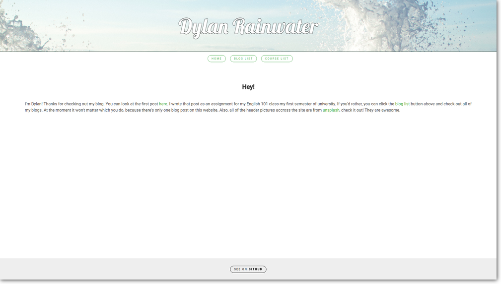
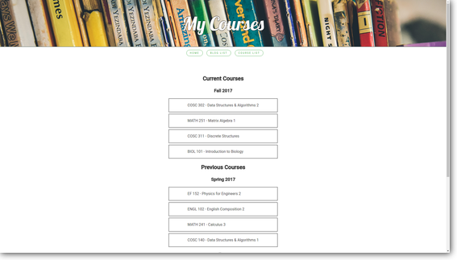

# dylanrainwater.github.io

This is just a personal website for whatever I want like my blog posts and a list of all courses I've taken.

# About

You can view at [dylanrainwater.github.io](https://dylanrainwater.github.io/).

Originally started as a blog post for an English class, now my personal website! It currently only has one blog post. The website is written with HTML, CSS, and JavaScript (with jQuery). The website utilizes Flexbox techniques to be responsive across devices.

There's also a list of courses that I've taken at college now!

# Blog Posts

1. [Beauty in Numbers](https://dylanrainwater.github.io/beauty_in_numbers.html)

# Pictures

All pictures (so far) have been taken from [unsplash](http://www.unsplash.com). Thanks!
